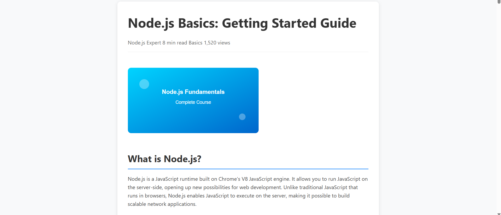
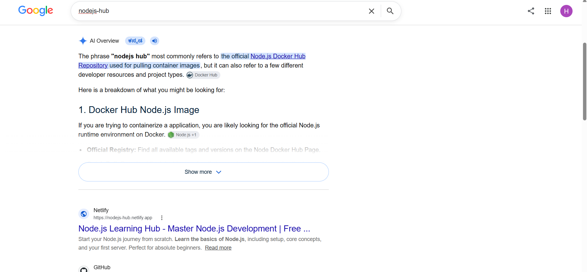

# NodeJS SEO Website

A Node.js-based website created to explore **Search Engine Optimization (SEO)** techniques and understand how SEO-friendly web applications are structured.

The project includes course pages, blog pages, search functionality, responsive UI, and SEO-related features such as metadata, sitemap, and `robots.txt`.

## 📸 Screenshots

### 🏠 Home Page

### 📚 Courses Page

### 📝 Blog Page

### 🔍 Search Functionality

### 📩 Contact Page

## ✨ Features

- SEO-friendly website structure
- Course pages
- Blog section
- Search functionality
- Responsive user interface
- SEO metadata
- Sitemap
- `robots.txt`
- Organized page routing
- Structured content organization

## 🛠️ Technologies Used

- **Node.js**
- **Express.js**
- **HTML**
- **JavaScript**
- **CSS**

## 🎯 Project Purpose

The main goal of this project was to understand how SEO-friendly websites are designed and structured using Node.js.

The project helped me explore how **content organization, routing, page metadata, sitemap configuration, and website structure** can contribute to better search engine optimization.

## 📚 Key Concepts Explored

- Search Engine Optimization (SEO)
- SEO-friendly URLs and routing
- HTML metadata
- Page titles and descriptions
- Sitemap
- `robots.txt`
- Content organization
- Internal navigation
- Search functionality
- Responsive web design
- Node.js web application structure

